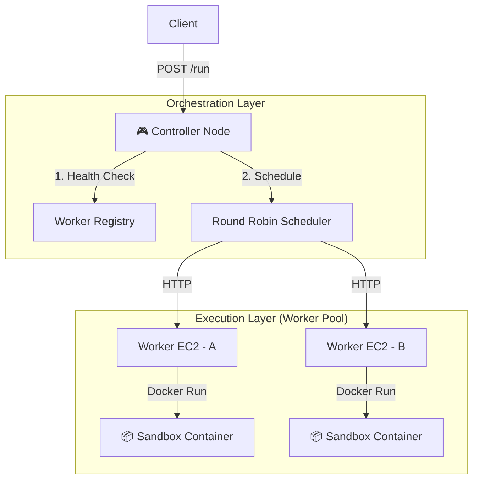

# ⚡ SnapRun

### Run Your Functions Instantly over HTTP. > AWS Lambda? Cloud Run? We built our own Serverless Engine on EC2.

## 📖 Introduction

SnapRun은 EC2와 같은 가상 서버(Bare Metal) 위에서 동작하는 자체 구축 Serverless FaaS(Function as a Service) 플랫폼입니다.

기존의 AWS Lambda나 Cloud Run 같은 매니지드 서비스를 전혀 사용하지 않고, Node.js로 직접 오케스트레이션(Load Balancing) 로직을 구현하고 Docker를 활용하여 안전한 샌드박스 실행 환경을 구축했습니다. HTTP 요청 한 번이면, 당신의 코드는 즉시 격리된 컨테이너에서 실행됩니다.

## 🚀 Key Features

* **Custom Load Balancing (No ALB)**: AWS ALB를 사용하지 않고, Controller Node가 Worker들의 상태(Busy/Idle)를 실시간으로 체크하여 Round Robin 방식으로 작업을 분배합니다.
* **Docker Sandboxing**: 사용자의 코드는 1회용 Docker 컨테이너(alpine) 내부에서 실행되며, 실행 직후 즉시 소멸(--rm)됩니다.

### Safety & Security

* **Resource Limit**: --memory=128m --cpus=0.5 제한으로 이웃 프로세스 간섭(Noisy Neighbor) 방지.
* **Time Limit**: 3초 이상 실행되는 코드는 좀비 프로세스 방지를 위해 강제 종료(Kill)됩니다.
* **Instant Execution**: 미리 준비된(Warm) Worker Node들이 요청 즉시 코드를 실행하여 Cold Start를 최소화합니다.


### Directory Structure
snaprun/
├── 📂 controller/              # [EC2-A] 두뇌 역할 (관제탑)
│   ├── controller.js           # 메인 로드밸런싱 서버 코드
│   ├── config.js               # Worker들의 IP 주소 목록 관리
│   ├── package.json            # dependencies: axios, express
│   └── .env                    # (선택) 환경변수 (포트 번호 등)
│
├── 📂 worker/                  # [EC2-B, C...] 실행 역할 (일꾼)
│   ├── worker_agent.js         # Docker 제어 에이전트 (작성해드린 코드)
│   ├── package.json            # dependencies: express, uuid
│   └── 📂 temp_scripts/        # (자동생성) 실행할 사용자 코드가 잠시 저장되는 곳
│
├── 📂 infra/                   # [Terraform] 인프라 자동화 코드 (가산점용)
│   ├── main.tf                 # EC2, Security Group 정의
│   ├── outputs.tf              # 생성된 EC2 IP 출력 설정
│   └── variables.tf            # 설정값 (AWS Region, KeyPair 이름 등)
│
├── .gitignore                  # node_modules, .env, .terraform 제외
└── README.md                   # 프로젝트 소개 및 실행 가이드

## 🏗 Architecture



**Controller (Brain)**: HTTP 요청을 수신하고 최적의 Worker를 선택하여 명령을 내립니다.

**Worker (Muscle)**: 전달받은 코드를 파일로 변환, Docker 컨테이너를 실행하고 Stdout을 캡처하여 반환합니다.

## 🛠 Tech Stack

* **Infrastructure**: AWS EC2 (Amazon Linux 2)
* **IaC (Infrastructure as Code)**: Terraform (Automated Provisioning)
* **Orchestrator**: Node.js (Custom Logic)
* **Runtime Engine**: Docker (Node:18-alpine image)
* **Communication**: HTTP (Axios)

## 💻 Getting Started

### Prerequisites

* Terraform Installed
* AWS CLI Configured
* Docker & Node.js

### 1. Infrastructure Setup (via Terraform)

저희는 Terraform을 사용하여 Controller 1대와 Worker N대의 인프라(EC2, Security Group)를 자동 구축했습니다.

```bash
cd snaprun/infra
terraform init
terraform apply -auto-approve

# Output:
# controller_ip = "3.12.xx.xx"
# worker_ips = ["3.15.xx.xx", "3.17.xx.xx"]
```

### 2. Worker Node Setup (Run on EC2-B, C...)

Worker는 실제 코드를 실행하는 일꾼입니다. (Terraform user_data로 자동 설치됨)

```bash
# 1. Access Worker Node
ssh -i key.pem ec2-user@<WORKER-IP>

# 2. Start Agent
cd snaprun/worker
node worker_agent.js
# Server running on port 3000...
```

### 3. Controller Node Setup (Run on EC2-A)

Controller는 요청을 받아 Worker에게 뿌려주는 관제탑입니다.

```bash
# 1. Access Controller Node
ssh -i key.pem ec2-user@<CONTROLLER-IP>

# 2. Start Controller
cd snaprun/controller
# Configure Worker IPs from terraform output
export WORKER_NODES="http://<WORKER-1-IP>:3000,http://<WORKER-2-IP>:3000"

node controller.js
# Load Balancer running on port 8080...
```

## 🔥 Usage (API Test)

```bash
curl -X POST http://<CONTROLLER-IP>:8080/run \
-H "Content-Type: application/json" \
-d '{
    "code": "console.log(\"Hello SnapRun! ⚡\");"
}'
```

Response:

```json
{
    "success": true,
    "output": "Hello SnapRun! ⚡\n",
    "meta": {
        "worker": "Worker-1",
        "duration": "120ms"
    }
}
```

## 🛡 Security Strategy (Why is it safe?)

| Threat             | Protection Mechanism                                        |
| ------------------ | ----------------------------------------------------------- |
| Infinite Loop      | setTimeout in Node.js triggers docker kill after 3 seconds. |
| Memory Leak        | Docker flag --memory=128m kills process on OOM.             |
| File System Access | Container is isolated; cannot access Host EC2 files.        |

